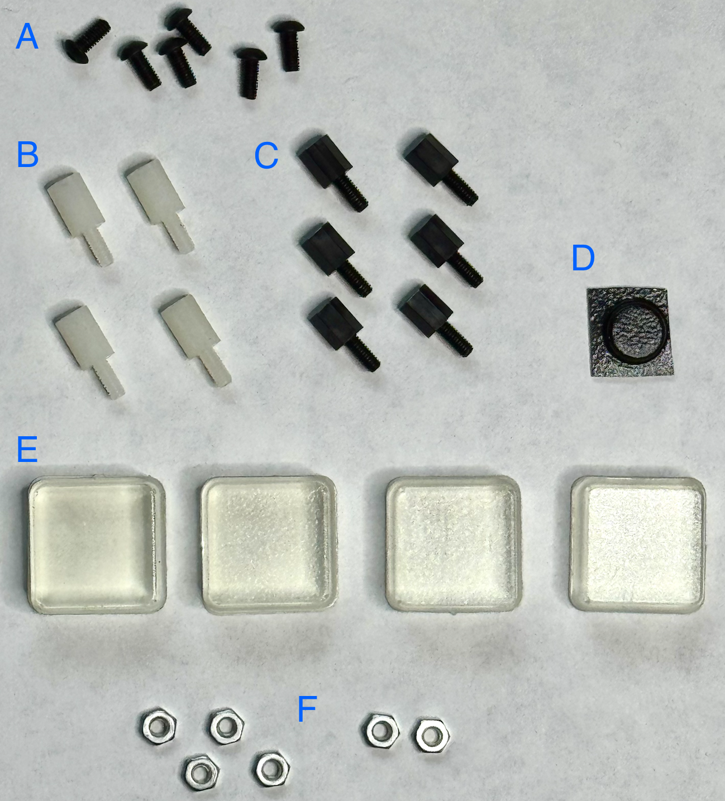

# Assembly Bill of Materials

This list covers the mechanical hardware required to assemble the custom 3D-printed enclosure.

<table  align="left">
  <tr>
    <td valign="top"  align="left">
      
    </td>
    <td valign="top">
      <table>
        <tr><th align="center">Ref</th><th align="left">Description</th><th align="center">Qty</th></tr>
        <tr><td align="center"><b>A</b></td><td>M2.5 4mm screw</td><td align="center">6</td></tr>
        <tr><td align="center"><b>B</b></td><td>M2.5 8+6 standoff</td><td align="center">4</td></tr>
        <tr><td align="center"><b>C</b></td><td>M2.5 6+6 standoff</td><td align="center">6</td></tr>
        <tr><td align="center"><b>D</b></td><td>SEN55 top bumper</td><td align="center">1</td></tr>
        <tr><td align="center"><b>E</b></td><td>Standoff feet</td><td align="center">4</td></tr>
        <tr><td align="center"><b>F</b></td><td>M2.5 nuts</td><td align="center">6</td></tr>
      </table>
    </td>
  </tr>
</table>